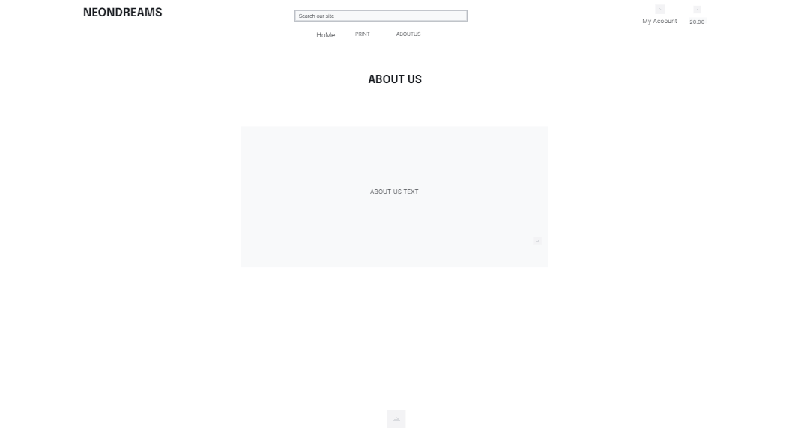

# Neon Dreams E-Commerce Site

## Portfolio 5 project as part of the Diploma in Full Stack Software Development by Code Institute.
Neon Dreams is an e-commerce website that allows users to purchase a variety of neon canvas artworks.

The live link can be found [here](https://neon-dreams.herokuapp.com/)

# Contents

* [Objective](<#objective>)
* [User Experience UX](<#user-experience-ux>)
    * [Target Audience](<#target-audience>)
    * [User Stories](<#user-stories>)
* [Design](<#design-choices>)
    * [Colour Scheme](<#colour-scheme>)
    * [Typography](<#typography>)
    * [Wireframes](<#wireframes>)
* [Features](<#features>)
* [Future Features](<#future-features>)
* [Technologies Used](<#technologies-used>)
* [Testing](<#testing>)
    * [Site Testing](<#site-testing>)
    * [Bugs](<#bugs>)
    * [Unfixed Bugs](<#unfixed-bugs>)
    * [Validator Testing](<#validator-testing>)
* [Deployment](<#deployment>)
    * [Deployment to Heroku](<#deployment-to-heroku>)
* [Marketing and SEO](#marketing-and-seo)
* [E-Commerce Business Model](#e-commerce-business-model)
* [Credits](<#credits>)
    * [Developer Team](<#developer-team>)

# Objective:

The main objectives are:

* ### Offer a wide variety of Neon Canvas Prints
    One of the primary objectives of an Art selling e-commerce store is to offer a vast collection of neon canvas prints to its customers. This would allow customers to choose from a variety of subjects and styles to find the one that suits their preference.
* ### Ensure secure transactions
    Ensuring secure transactions is essential for any e-commerce store. Providing a secure payment gateway and protecting customers' sensitive information can help build trust and credibility.

[Back to top](<#contents>)

# User Experience (UX):

## Target Audience

- ### Art enthusiasts
    People who are passionate about art and want to expand their collection would be a natural target audience for an art online store. They are likely to have some knowledge of art and may be interested in rare or exotic prints.

- ### Home owners 
    Home owners who enjoy adding vibrant images to their living spaces could also be a target audience for a neon art online store. These customers may be interested in neon prints as a unique addition to their home or as a way to bring a mood to their indoor space.

- ### Gift shoppers
    Canvas prints can make a thoughtful and unique gift for a special occasion or to show appreciation. The target audience for gift shoppers could include people looking for a gift for a loved one or corporate clients.

- ### Interior designers
    Interior designers who want to add eye-catching elements to their design could be a target audience for a neon print online store. They may be interested in incorporating a print into their design projects for commercial or residential spaces.

- ### Collectors
    Collectors who are interested in rare and exotic prints could also be a target audience for a neon print online store. These customers may be willing to pay a premium price for a unique print that is not found anywhere else.

## User Stories

### New Visitor Goals

* Understand what the site is about.
* How to find a print they like
* How to register
* How to place an order
* How to subscribe to a newsletter
* Like a print

### Existing Visitor Goals

* Check new prints
* Place an order
* Check on their previous orders
* Edit their profile
* Like a print

## Agile
### Agile was used for this project. 
- The project board can be found [here](https://github.com/users/Sdalsosa/projects/5/views/1) that lists the user stories.

- All User Stories can be found [here](https://github.com/Sdalsosa/ecommerce/issues?q=is%3Aissue+is%3Aclosed)

- Milestones (Epics) can be found [here](https://github.com/Sdalsosa/ecommerce/milestones?state=closed)

[Back to top](<#contents>)

# Design Choices

## Colour Scheme

The colour scheme used for this project was four colors to maintain a simple and clean look while staying consistent with the theme as the images themselves are very colorful 

* White #ffffff
* Mauve #de9cf8
* Electric Purple #53837a
* Jet #2a2a2a

## Typography

The font used for the site was Poppins from google fonts.

## Wireframes

[Back to top](<#contents>)

# Features

## ERD Data Model 

## Home Page

The home page contains a nav bar with a search bar, menu items with dropdowns and the site logo. The body contains a link to the newsletter subscription page and a start shopping button to take the user to the store page. The footer contains a link to our facebook page.

## Newsletter Subscription Page

This page allows the user to subscribe to our Newsletter by entering their email address.

## Add Prints Page

This page is only viewable by admin by selecting Stock Management under their account dropdown. This allows them to add new prints to the site.

## Prints Page

This page shows each of the print categories and shows the prints listed as per the sorting chosen by the user. Each item can be clicked on to take the user to the single-print page. If a user is authenticated, they can like the image by clicking on the heart and the number of likes will increment. They can click again to unlike it.

## Single Print Page

This page shows a single print and its details allowing the site user to view a picture and learn more about it. They can also add it to their cart from this page and like it if they are authenticated. As an admin, you will have the option to edit or delete the print. If delete is selected, a popup confirmation appears before deleting.

## Edit Print Page

This page is only accessible by admin where they can edit the print and update it.

## Shopping Cart

This page shows the site user their shopping cart and lists the items they have added and the quantities and cost. It also will display a message if the users cart is less than €1000 to let them know that they can get free deilivery by adding the difference in amount from €1000 to their order.

## Checkout Page

This page shows the site user their checkout page and lists the items they have added and the quantities and cost. It also contains a form so the user can add their delivery details and payment card. They also have the option to store their details to speed up checkout for their next order if they are a registered user.

## Order Page

After checking out, the user is taken to this page which gives a summary of their order. When authenticated users view there profile, they can view this order page again by selecting one of their previous orders.

## Profile Page

Authenticated users can view their profile and this is where they can add their delivery details or edit them if they were automatically added from their first order. They can also view their previous orders and click on them to go back to the order page.

## About Page

This page gives the user information about the site and also provides the link to our privacy policy

## Contact Us Page

This page gives the user the ability to message us with their questions or feedback by entering their info into the form.

## Messages Page

This page gives the Admin the ability to view a list of all messages that have been sent through the contact us form. They can click on each message and it will open that message in another page.

## Message Page

This page gives the admin the ability to read the individual messages that users have sent in using the contact us form. Admin also have the ability to delete these messages when done.

## Registration Page

This page gives the user the ability to register on the site They will need to verify their email address before being able to log in.

## Verification Page

After registering for an account, the user is taken to this page initially and back here if they have failed to verify their email.

## Login Page

This page gives the user the ability to log into the site.

## Logout Page

This page gives the user the ability to log out of the site.

## 404 Page

This page shows up when the user tries to access a page that doesn't exist.

## Message Success

This modal shows up with a neon tick for success messages with custom text depending on the situation.

## Message Error

This modal shows up with a neon X for error messages with custom text depending on the situation.

[Back to top](<#contents>)

# Future Features

* Stock management system to reorder once stock reaches a certain level
* Coupon, Special offers and discount code system

[Back to top](<#contents>)

# Technologies Used

Here are a list of technologies used in this project

- [GitHub](https://github.com/) Used to host website
- [Gitpod](https://www.gitpod.io/) Used as IDE
- [Git](https://git-scm.com/) Version control
- [HTML](https://developer.mozilla.org/en-US/docs/Web/HTML) 
- [CSS](https://developer.mozilla.org/en-US/docs/Learn/Getting_started_with_the_web/CSS_basics) 
- [JavaScript](https://www.javascript.com/) 
- [Coloors](https://coolors.co/) Used to display the color palette image in the readme.
- [PEP8 Validator](http://pep8online.com/) Used to check python code for errors
- [Font Awesome](https://fontawesome.com/) All icons throughout the page
- [Elephand SQL](https://www.elephantsql.com/) Used for the PostgreSQL databases in the project
- [Heroku](https://id.heroku.com/login) Used to deploy the project
- [Lucid](https://lucid.co/) Used to design the flowchart
- [Adobe Photoshop CS6](https://www.adobe.com/ie/products/photoshop.html) Used to create and edit images used for the readme.
- [Tinypng](https://tinypng.com/) - Used to optomise images for web

[Back to top](<#contents>)

# Testing 

I have spent many hours testing this site and had friends go through it for me also.

This led to some issues being identified which are listed below.

## Site Testing

| TEST | OUTCOME | PASS / FAIL |
|:---:|:---:|:---:|
| Home page  | Page loads correctly and all links/dropdowns are active | PASS |
| Search form | works correctly and triggers modal if empty | PASS |
| Prints page | Page loads correctly and all links and sorting is active | PASS |
| Single print page | Page loads correctly and all links are active | PASS |
| Likes toggle | Likes toggle works when user is authenticated and increments and decreases accordingly | PASS |
| Delete print | Delete button triggers confirmation box before deleting print | PASS |
| Edit print | Edit button brings to correct print | PASS |
| About Us Page | Page loads correctly and all links are active | PASS |
| Contact Us Page | Page loads correctly and form works as expected all links are active | PASS |
| Messages Page | Page loads correctly and form works as expected all links are active | PASS |
| Single Message Page | Page loads correctly and form works as expected all links are active | PASS |
| Delete Message | Delete button triggers confirmation box before deleting the message | PASS |
| Newsletter Subscription | Page loads correctly and form works as expected all links are active | PASS |
| My Account dropdown | Stock management link only shows for admin users | PASS |
| Register Page | Page loads and form works correctly with verification and all links are active | PASS |
| Verification Page | Page loads correctly and all links are active, once verification email is followed, user can log in successfully | PASS |
| Sign In Option| Only available if not signed in| PASS |
| Sign Out Option| Only available if signed in| PASS |
| Sign In page| Page loads and form works correctly and all links are active and confirmation works | PASS |
| Sign Out page| Page loads, button works and all links are active and confirmation works | PASS |
| Cart Page | Page loads correctly and all links are active with correct quantitys, items and totals | PASS |
| Checkout Page | Page loads correctly and all links are active and order completion with confirmation works | PASS |
| Profile Page | Page loads correctly, all details load for editing, all links are active and order history works | PASS |
| Order History | Page loads correctly, all details load and all links are active | PASS |

## Bugs

* Whe using the contact us form, submitting the form was generating a Server 500 error - rectified by migrating db after small change.
* When trying to create a new account, the account was being created but it would generate a server 500 error only on deployed site. It worked fine locally. Disabling verification was successful as a work around but I wanted to have the verification email as a confirmation and eventually found a mistake in the settings.py email settings that rectified the issue when corrected.
* Loading overlay was failing to disappear when called. - resolved this by fixing an error in the JS code. 

## Unfixed Bugs

* To the best of my knowledge there are no further bugs present 

## Validator Testing 

#### JavaScript
- All JavaScript code in the project was validated using ESLint https://eslint.org/

#### HTML Validation
- HTML showed some errors when using the W3C Markup Validation Service https://validator.w3.org/
  These errors were related to the nav elements duplication between desktop and mobile views which was expected.

#### CSS Validation
- Some errors were found when the single CSS file style.css was passed through the W3C Validation Service https://jigsaw.w3.org/css-validator/ These errors are false errors as scale is a valid css function.

### Python Validation
  - No errors were found when passing through the official PEP8 validator https://www.pythonchecker.com/
  

[Back to top](<#contents>)

# Deployment

## AWS S3 bucket for static storage.
An AWS S3 bucket was utilised to store static and media files. The bucket is publicly accessible for downloading files to facilitate this use. 

## Create an ElephantSQL PostgreSQL database
* Create an ElephantSQL account or log into your exisiting account on the ElephantSQL website and signing up for an account. Follow the instructions to create a new database.
* Install the ElephantSQL package in your Django project by running the command "pip install psycopg2"
* Update your Django project settings.py file to use the ElephantSQL database. Make sure to keep the database URL in the env.py file.
* Migrate the database using python manage.py migrate.
* Runserver to see if the database connection is working correctly.

## Deployment to Heroku

* Log into Heroku or create an account if you don't already have one.
* Click 'New' from the top right of the screen.
* Select 'Create new app'.
* Enter a unique application name - select appropriate region.
* Click 'Create app'
* On the following page, click the 'Settings' tab and scroll to Config Vars.
* Enter the variables required for AWS, Stripe, ElephantSQL, Email and Secret Key
* Create a Procfile in your project directory with gunicorn settings
* Add Heroku project url to allowed hosts in settings .py.
* At the top of the page, click 'Deploy'.
* Select Github as the deployment method.
* Search for and select correct repository and click 'Connect'.
* At the bottom of the same page, select either Automatic Deployment or Manual Deployment 
* Wait for your site to be deployed.

[Back to top](<#contents>)

# Marketing and SEO

The SEO keywords that were mind mapped and researched resulted in the following 15 keywords and phrases

- Neon canvas art
- Custom neon canvas prints
- Modern neon wall art
- LED canvas prints
- Neon signs on canvas
- Personalized neon wall decor
- Contemporary canvas prints
- Bright neon artwork
- Unique neon canvas prints
- Neon light wall art
- Vibrant neon canvas paintings
- Affordable neon canvas art
- High-quality neon canvas prints
- Neon home decor
- Eye-catching neon wall hangings.

## E-Commerce Business Model

E-commerce business model refers to the process of buying and selling goods and services online. It typically involves a website or an online platform that allows businesses to showcase their products and services and allows customers to purchase them. With that in mind, the following considerations were taken into account when desiging the Neon Dreams website:

### Online store: 
The website gives us the ability to showcase our prints. It is designed to be user-friendly and provides customers with a smooth shopping experience.

### Product catalog: 
The prints that are offered for sale include a description, an image, and pricing information.

### Shopping cart: 
The cart allows customers to select prints they wish to purchase and stores them while they continue to shop. It helps customers keep track of what they have selected and the total cost of their purchases.

### Payment gateway: 
Th stripe payment system utilised in this project allows us to accept payments online securely. 

### Fulfillment: 
Not in the scope of this project

### Customer service: 
Not in the scope of this project but we do have a contact us form.

Overall, the e-commerce business model is designed to provide a platform to reach a wider customer base and provide customers with a convenient and seamless shopping experience.

## Facebook Page
A Facebook page was created for the site for marketing purposes. This will be used to post new prints and engage with potential customers. Also with the possibilty of running giveaways to generate shares.

# Credits
[Midjourney](https://www.midjourney.com/)- all the prints were generated using Midjourney AI

[Python Documentation](https://docs.python.org/3/) 

[Code Institute](https://learn.codeinstitute.net/) 

[Stack Overflow](https://stackoverflow.com/) 

[Back to top](<#contents>)

## Developer

* Alan Egan - Junior Software Developer at Code Institute

[Back to top](<#contents>)